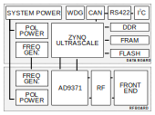

# P4XDMT Hardware Prototype

The P4XDMT is an advanced amateur radio satellite transceiver offering high performance SDR capabilities.

Visit the sections on the left to view more information about different aspects of the design.