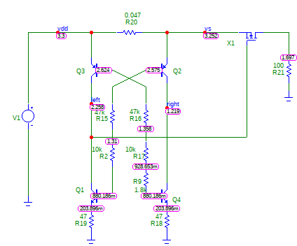
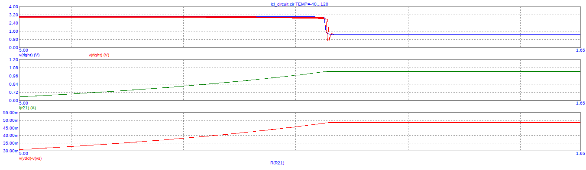

# LCL Design

Some investigative work into an LCL topology has been performed.

The LCL (Latching Current Limiter) is an important circuit in the protection of circuits from SEU latch-up. When a high-energy particle causes a latch-up event within bulk CMOS devices the extra current must be detected and removed before permanent damage is caused. To achieve this a fast current limiting circuit is required.

To achieve this a translinear loop based current limiting circuit has been designed. It uses matched pair bipolar devices to determine the current through a sense resistor and limit the current at the load using a pass FET.

A circuit was designed and simulated in MicroCap as shown below:

By using thermistors with appropriate temperature coefficients the effect of temperature on the operation of the circuit be compensated showing precise performance over temperature:

